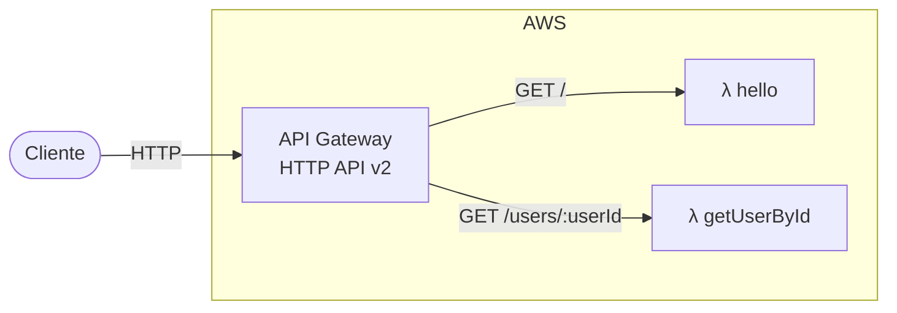

# ⚡ API Serverless

<p>
  
  
  
  
  
</p>

HTTP API em Node.js + TypeScript sobre AWS Lambda e API Gateway, feita com o Serverless Framework v4. Projeto de estudo.

## Stack

| Categoria       | Ferramenta                                            | Versão    |
| --------------- | ----------------------------------------------------- | --------- |
| Framework       | [Serverless Framework](https://www.serverless.com/)   | `v4`      |
| Runtime         | [Node.js](https://nodejs.org/)                        | `24.x`    |
| Linguagem       | [TypeScript](https://www.typescriptlang.org/)         | `^7.0.2`  |
| Package manager | [pnpm](https://pnpm.io/)                              | `^11.5.0` |
| Lint & Format   | [Biome](https://biomejs.dev/)                        | `2.5.4`   |

## Arquitetura



## Endpoints

| Método | Rota              | Resposta                          |
| ------ | ----------------- | --------------------------------- |
| GET    | `/`               | `{ "message": "Hello, World!" }`  |
| GET    | `/users/{userId}` | `{ "user": "<userId>" }`          |

## Rodando localmente

```bash
pnpm install
pnpm dev
```

```bash
curl http://localhost:3000/
curl http://localhost:3000/users/123
```

## Deploy

```bash
serverless deploy
```
